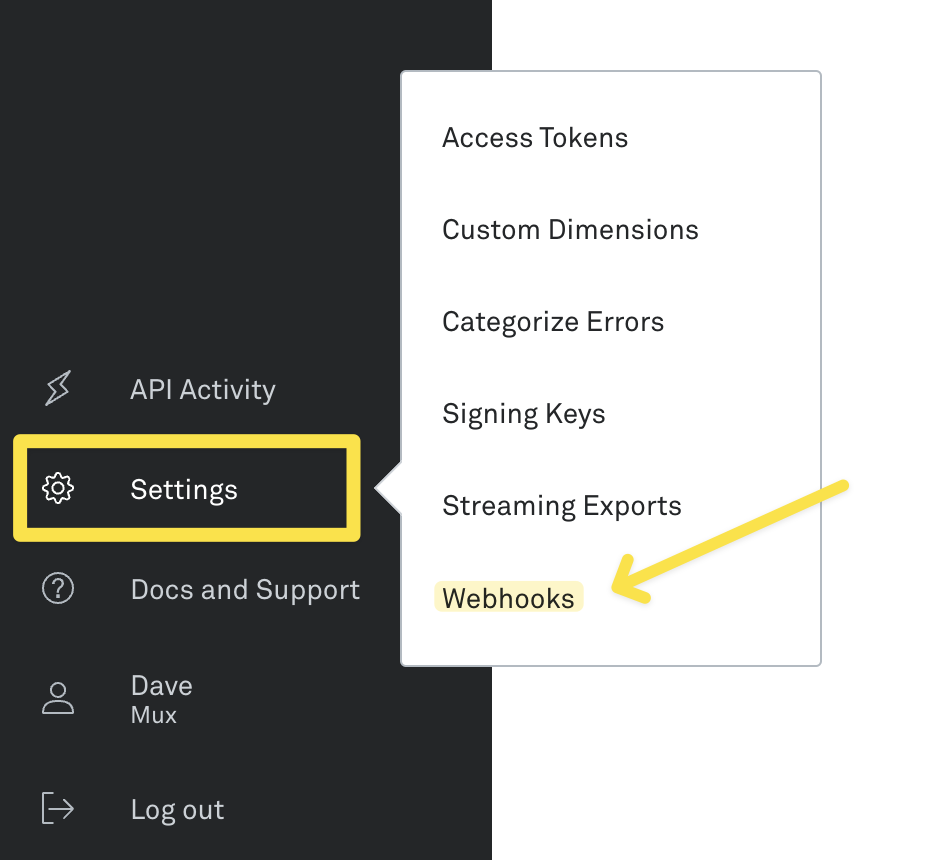
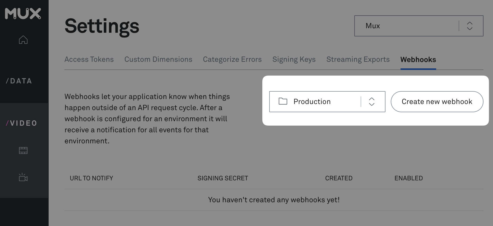
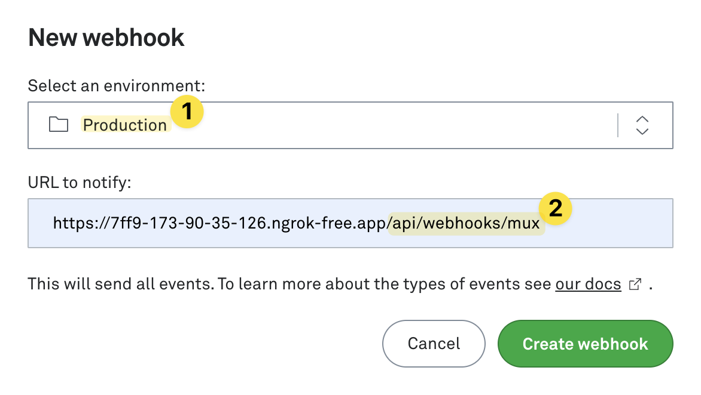
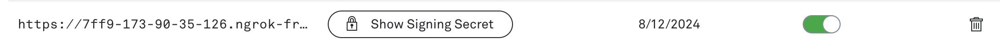

# Mux Webhook Handler

Handle incoming Mux webhooks with your eyes closed (basically)

## Installation

Add the `@mux/webhook-handler` package to your project's dependencies:

```bash
npm install @mux/webhook-handler
```

## Creating your webhook receiver in Mux

1. Visit [the Mux dashboard](https://dashboard.mux.com) and navigate to **Settings &rarr; Webhooks**



2. In the dropdown selector, choose the Mux environment in which you'd like to create your webhook. Then, click **Create new webhook**



3. In the **Select an environment** select box, choose the Mux environment in which you'd like to create your webhook receiver. Then, enter the **URL where you'd like to send your webhooks.**

> Be sure to add the entire route to your webhook handler route file, not just the root domain.



4. After you create your webhook, click the button labeled **Show Signing Secret.** Copy the value that appears into your application's environment variables using the name `MUX_WEBHOOK_SECRET`.



## Using with Next.js

Create a route handler file at your preferred location, eg. `/app/api/webhooks/mux/route.ts`.

> `/app/api/webhooks/mux/route.ts` will route incoming requests to `/api/webhooks/mux`. Make sure your webhook matches the path you set in the Mux dashboard.

Then, implement your logic inside the configuration passed into `createWebhooksHandler` to handle the various events sent from Mux.

```js
import { createWebhooksHandler } from "@mux/webhook-handler";

const handler = createWebhooksHandler({
  // Add/remove optional handlers to get access to the data.
  onVideoAssetCreated: async (payload) => {
    // Update a video in the database
    console.log("video updated!", payload)
  },
  onVideoAssetDeleted: async (payload) => {
    // Delete a video in the database
    console.log("video deleted!", payload)
  }
})

export const POST = handler.POST
```